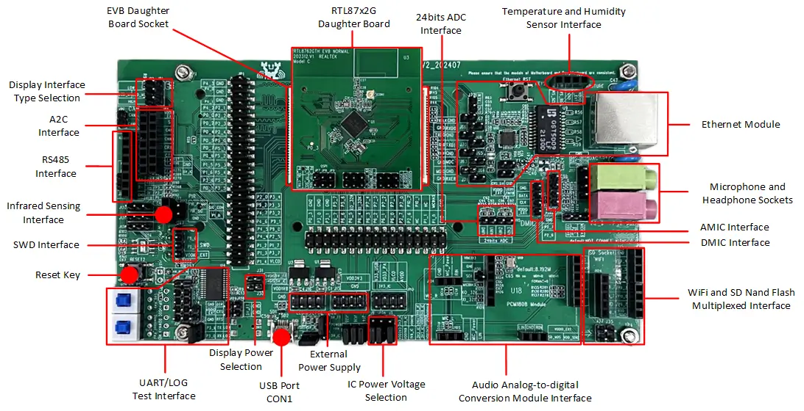
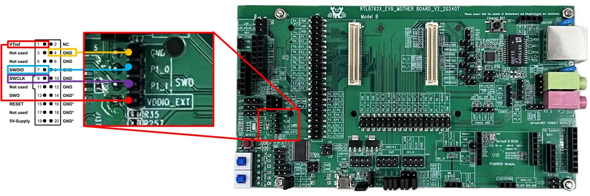

.. _rtl87x2g_evb:

RTL87X2G-EVB
#############

Overview
********
RTL87X2G-EVB contains a mother board known as the RTL87x2G Model B Evaluation Board, along with an interchangeable daughterboard that houses
a real RTL87x2G series SoC.

Hardware
********

The RTL87x2G series contains various chip types, each supporting different hardware features.

Below are the common hardware features of the RTL87x2G series:

- KM4 core compatible ARM-M55 core MAX@125MHz
- M-profile Vector Extension (MVE) for vector computation
- 32KB Icache, 16KB Dcache, and 384KB SRAM
- Some part numbers  include MCM 4MB PSRAM
- Hardware keyscan / Quad Decode
- Flash On-The-Fly
- Embedded IR TX/RX
- ISO7816
- SPIC/SPI_m/SPI_s/SDIO/SD(eMMC)
- Low power comparator
- 8CH - AUXADC
- 24bit HD ADC
- CAN
- RMII for Ethernet
- I2S/DAC/AMIC/DMIC/PDM
- SPIC/RGB888/SEGCOM
- USB2.0 High-Speed interface

The `RTL87x2G Introduction`_ has detailed hardware information about specific part number of RTL87x2G series.

Mother Board
==================
RTL87x2G Model B Evaluation Board supports these features:

- 5V to 3.3V & 1.8V power module
- Support QSPI (Group1), I8080 (Group2), RGB888 display interface
- Support audio module (AMIC, DMIC, AEC) interface
- Support Wi-Fi module and SD Nand Flash module interface
- Support RS485 and A2C interface
- Support infrared sensing interface
- Support temperature and humidity sensor interface
- Ethernet module
- USB to UART chip, FT232RL

Supported Features
==================

RTL87X2G-EVB's board configuration supports the following hardware features:

+-----------+------------+-------------------------------------+
| Interface | Controller | Driver/Component                    |
+===========+============+=====================================+
| NVIC      | on-chip    | nested vector interrupt controller  |
+-----------+------------+-------------------------------------+
| SYSTICK   | on-chip    | systick                             |
+-----------+------------+-------------------------------------+
| GPIO      | on-chip    | gpio                                |
+-----------+------------+-------------------------------------+
| PINMUX    | on-chip    | pinctrl                             |
+-----------+------------+-------------------------------------+
| CLOCK     | on-chip    | clock control                       |
+-----------+------------+-------------------------------------+
| UART      | on-chip    | serial port                         |
+-----------+------------+-------------------------------------+

Other hardware features are not currently supported by Zephyr.

Connections and IOs
===================

Please refer to `RTL87x2G EVB Model B Interfaces Distribution`_ which has detailed information about board interfaces.

System Clock
============
The RTL87x2G series has a built-in 40MHz crystal oscillator circuit to provide a stable and controllable system clock.

Serial Port
===========

The RTL87x2G series has 6 UARTs. By default, UART2 is configured for the console and log output.

Programming and Debugging
*************************

Prerequsite
===========================

Essential Images
-------------------
To run a Zephyr application on the RTL87x2G, there are five essential images that need to be programmed into the board in addition to the Zephyr image.
You can fetch these five images, the default flash layout, and a detailed explanation in `rtkconnectivity`_.

To download these images, MP Tool (for Windows) and MPCli Tool (for MAC/LINUX) developed by Realtek are recommended.

- The MP Tool download guide is in the `RTL87x2G MP Tool Guide`_. Morever, the `RTL87x2G MP Tool Download Example`_ provides a specific step-by-step examplefor RTL87x2G image downloading using MP Tool.
- The MPCli Tool download guide is in the `RTL87x2G MPCli Tool Guide`_.

The principle of the download method for MP/MPCli tools is via the UART interface. Note that P3_1 and P3_0 are required for using the UART downloading interface.
To enter download mode for EVB model B, press the log key and the download mode key together and then press the reset key. After downloading, both keys need to be
pressed again and released to enter normal mode.

For flashing the Zephyr Image, we provide two methods:

- Using the default west flash through J-Link.
- Using Realtek MP/MPCli Tool.

Here in this document, we will focus on how to flash the Zephyr Image via J-Link.

J-Link Configuration
---------------------
The RTL87x2G series is currently not officially supported in J-Link. In order to use J-Link, we need to add RTL87x2G to the J-Link software.
Please refer to `RTL87x2G J-Link Configuration`_ for detailed instructions.

Flashing
=========

The J-Link connection methods for RTL87x2G EVB model B are shown in the below.

     J-Link Connection with EVB model B SWD interface

Make sure you have correctly configured J-Link and connected board with
J-Link. Then build and flash the :zephyr:code-sample:`hello_world` application.

   .. zephyr-app-commands::
      :zephyr-app: samples/hello_world
      :board: rtl87x2g_evb
      :goals: build flash

Visualizing the message
=======================

#.Connect the UART:

   - Connect P3_2 (TX of UART2) to the RX of the RS232 module.
   - Connect P3_3 (RX of UART2) to the TX of the RS232 module.

#.Open a serial communication tool that you are familiar with:

    - Set the baud rate of the port where the RS232 module is connected to 2000000.

#.Press the reset button:

    - You should see “Hello World! rtl87x2g_evb” in your terminal.

Debugging
**********

You can debug an application in the usual way.  Here is an example for the
:zephyr:code-sample:`hello_world` application.

.. zephyr-app-commands::
   :zephyr-app: samples/hello_world
   :board: rtl87x2g_evb
   :maybe-skip-config:
   :goals: debug

References
**********

.. target-notes::

.. _RTL87x2G Introduction:
    https://www.realmcu.com/en/Home/Product/RTL8762G-RTL877xG-Series

.. _RTL87x2G Documentation:
    https://www.realmcu.com/en/Home/DownloadList/c175760b-088e-43d9-86da-1fc9b3f07ec3

.. _RTL87x2G EVB Model B Interfaces Distribution:
    https://docs.realmcu.com/sdk/rtl87x2g/common/en/latest/doc/evb_guide/text_en/model_b.html#interfaces-distribution

.. _RTL87x2G MP Tool Guide:
    https://docs.realmcu.com/sdk/rtl87x2g/common/en/latest/doc/tool_set/text_en/README.html#mp-tool

.. _RTL87x2G MP Tool Download Example:
    https://docs.realmcu.com/sdk/rtl87x2g/common/en/latest/doc/quick_start/text_en/README.html#mp-tool-download

.. _RTL87x2G MPCli Tool Guide:
    https://docs.realmcu.com/sdk/rtl87x2g/common/en/latest/doc/tool_set/text_en/README.html#mpcli

.. _rtkconnectivity:
    https://github.com/rtkconnectivity/realtek-zephyr-project

.. _RTL87x2G J-Link Configuration:
    https://docs.realmcu.com/sdk/rtl87x2g/common/en/latest/doc/platform/debug_system/text_en/README.html#j-link-commander-swd-debugging
